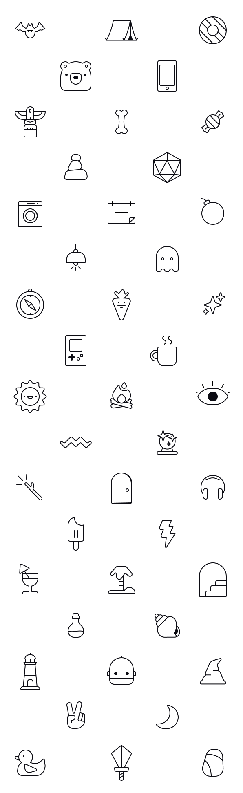

Icons are used to visually represent concepts, actions, figures, or objects in a compact and easily recognizable (if you have the mental model, like a floppy disk for a save action, but that's a topic for another time) form. You can use icons to make your product easier to understand and visually appealing to whoever uses it. From toy instructions to app navigation.

I've designed icons for 20 years or so. Sometimes for people, always for fun. I like the challenge in visually describing a thing or situation in the simplest way. It's a good puzzle to solve, and it's always fun to see the final result. From complex images to simple symbols. To remove details until the shape show just enough to be understood.

Perhaps you need icons for your thing? The easiest way to get in touch with me is to [send me an email](mailto:hei@joacimeldre.com).

# Inspiration

I get inspiration for icon design by life around me. Nature, human made objects, and things on the internet.

Other times fine people ask me to design icons to visually describe whatever they need for their thing. Once in a while they know what they want, and if they don't, we find out together.

# Dream 🦄

A dream of mine is to design icons for a video game or physical toy.

And to make an icon font or library, and make it available in a way that makes it easy for people to use in their own projects. Kind of like Font Awesome! It would be incredible to contribute icons or an icon style to their icon library. I enjoy designing icons and it would be nice to share them with others.

# Tools

I typically sketch icons with a pen on paper and it's always fun to see what pops up. When the look and feel works, I finalize the icon in vector graphics.

To sketch, I use a Copic Multiliner pen and thick paper, or [Procreate](https://procreate.com/ "Procreate is an app for raster drawing on iPad") on my iPad.

To finalize, I use [Figma](https://figma.com/ "Figma is a web application for prototyping with vector graphics and allows for easy collaboration") or [Affinity Studio](https://affinity.serif.com/en-us/studio/ "Affinity Studio is a desktop application suite for vector and raster graphics") if I need more features. I enjoy limitation, so Figma is often more than enough.

# One more thing

About mental models from the start of this post. In the grid below, do you see what all of the icons are?

