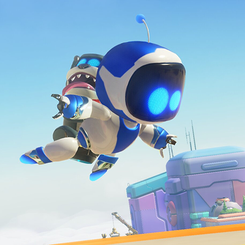
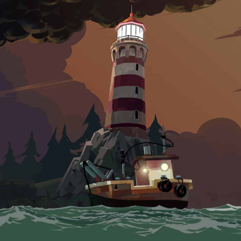
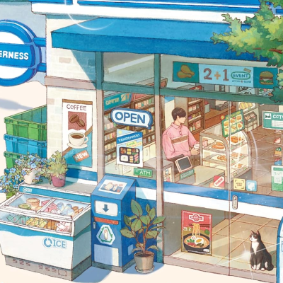
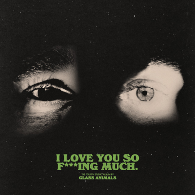
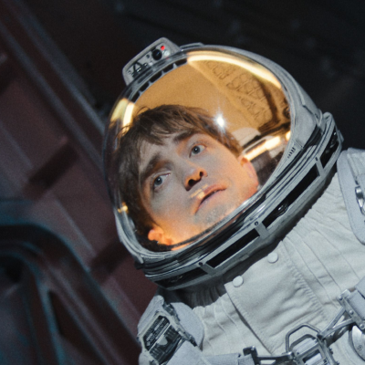
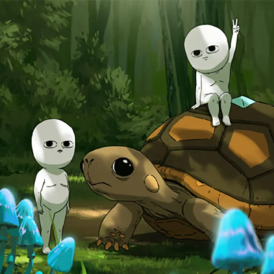

Okay, hold on. I drew that image up above for this post, I wanted something abstract that was colorful, that would convey a sense of playfullness and fun. Now that I've seen the image over and over, it's inspiring me to want to create a game where you have to match shapes and colors on time. I can imagine how it would play. Maybe I'll make that one day!

Okay, now I'll yap about my favourite entertainment in 2025!

# Video Games

## Astro Bot

Astro Bot is **one of my favourite video games, ever**. I picked it up in the end of 2024, and played through 2025. I still play from time to time. Family friendly too.

You play as Astro, a small robot that's on a mission to rescue all of their friends and find parts to fix their spaceship, a PlayStation 5. 

Throughout the game you meet various attachments that lets you do different things, like frog gloves that springs your punch, or monkey hands that lets you grab and climb. You run around and jump on platforms, solve puzzles, and bonk peculiar enemies and bosses. Oh and along the way you collect little bots and secrets hidden throughout the game world. It's a super creative game made with a lot of heart and attention to detail.

Astro Bot is playable on PlayStation 5.

- [ ] Play Astro Bot.

I included the checkbox above, because I made it interactable. You can check and uncheck it!

Haha, it's a novel little thing, I had fun designing it. Now I'm curious if I can make it so that you can write your own checklist, and check it off as you go. That would be fun! Maybe I'll make a tiny to do app somewhere on my website.

## Dredge

Dredge is a cosmic horror fishing adventure game with a dark twist. You play as a fisherman who has to catch fish and explore the ocean, but as you go deeper, you encounter strange and eerie creatures, and get pulled deeper into the misadventure of the fisherman you've replaced. Featuring a hand drawn art style and haunting atmosphere that pulls you in.

During most of my playthrough, I sat on the edge of my couch, gripping the controller tightly while navigating through the dark waters. My ex girlfriend laughed at me as I jumped around and yelled at the game. Dredge is a mix of relaxing fishing and intense moments of getting away.

If I had to pick one thing I enjoyed the most in Dredge, I'd say the inventory management. It's slot based, so you have to carefully choose which equipment and items to bring with you on your trips. It adds an extra layer of strategy to the game.

Dredge is playable on Nintendo Switch, PlayStation 4 and 5, Xbox One and Series X and S, PC, iOS, and Android.

# Books

## The Convenience Store by the Sea

Written by Sonoko Machida is a warm novel about finding joy in the small every day things in life and the connections we make. The story follows Tenderness, a convenience store in Mojiko, Japan, the people who work there, and its customers.

The convenience store has a strange manager with his own fanclub. One of the employees writes and draws a manga about the manager. The story is quirky and wholesome. The book gave me comfort during a time when I was left by *the person* I've been closest to, I needed all the pick me ups I could get.

# Music 

## Glass Animals - I Love You So F***ing Much

I liked Glass Animals from the moment I heard their hit song, Heat Waves. I Love You So F\*\*\*ing Much is their fourth studio album, it sounds very different to their previous albums. I think that's a good thing. It's great when artists experiment and discover new ways to express themselves. 

Their sound for this album is a mix of indie pop rock and electronic music, with clever lyrics about human connections.

In the same way that The Convenience Store by the Sea was a comfort read for me, I Love You So F\*\*\*ing Much was a comfort album. I listened to it a lot during the same time. There's an underlying sadness with deeper meaning if you want to go there, but overall it's an uplifting and feel good album that goes into the complexity of relationships.

# Movies

## Mickey 17

Mickey 17 is a sci-fi movie about a clone named Mickey. Mickey is disposable and dies, a lot. The movie explores what it means to be human. It's a thought provoking movie that made me think about the value of this one life we have.

I also liked the alien wooly mammoth creatures a lot. Go mom and kid alien wooly mammoth creature, go!

# TV Shows

## Common Side Effects

Common Side Effects is an animated TV show about a scientist outcast who have found a mushroom that can cure any disease. And then things go bad!

The genre of Common Side Effects is a mix of sci-fi, drama, and comedy. I really like the art style and animation, it's loose and expressive, thin lines and a thoughtful and restrictive use of color.

The characters are quirky, on the nose, fun, and easy to relate to.

The show explores themes of friendship, mental health, and it asks the question of what happens to us humans if we take modern medicine and technology too far. It's a show that makes you think, but also makes you laugh and feel good.