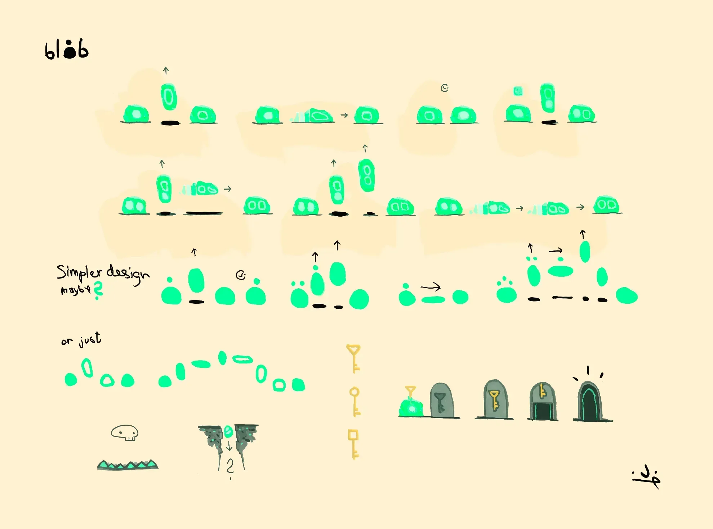

# Bloob?

What's a bloob? It's a blob made of jelly. A bloob can have bloobs inside of itself. Bloob searches for other bloobs to consume and become more. Bloob can jump or dash, maybe even jump and dash, but bloob needs bloobs to do that. Bloob doesn't like spikes or holes, it simply loves to explore and find secrets.

Bloob is a tiny video game I'm making in PICO-8. It's a platformer with no enemies, no text, and no score. Just you, the bloob, and the world to explore.

# Sketches

Note: Early visualization of Bloob. Core elements and movement is kneaded and roughed out in different styles.

# Design notes

The list below is copy paste from my design notes. I just wanted to put it out there, makes me feel more comitted. This will definitely change and refine as I start making the game.

- Jelly plattformer.
- Bloob starts with 1 bloob. Tutorial to learn how to use it.
  - Jump or dash (any direction) uses bloob.
  - Bloob regenerate over time spent on ground.
  - Find 1 more bloob to learn jump & dash.
    - Or _jump jump dash_, or _dash jump dash_, or _jump jump dash jump dash_.
  - I'll see how many bloobs I need to make the game fun and interesting.
  - All bloobs required to find _all the secrets_.
- Get to end of level.
  - Level has multiple endings?
  - Level checkpoints.
  - Get key to door.
    - Door can have multiple locks, each lock requires a key.
- Travel?
- Screen move from map to map. Locked camera.
- Bloob dies from environment.
  - Hazards: spike (jelly don’t like), hole (maybe secret, probably respawn).
  - Modifier: ice (fast, slippery), sand (slow, sinking).
- No enemies.
- No text.
- No score, only time. Maybe time is score? Who knows.
- Easter eggs. That's secrets. Now I'm curious why secrets and references in video games are called easter eggs. It's not like they have chocolate in them.. Or.. Do they!?
- Secrets: Color palettes? Music?
- Bosses? Maybe not, maybe just fun and challenging level design.

# Next steps

Get a playable prototype going in PICO-8. I have no idea how PICO-8 works, so I'll be learning as I go. I'll start with the basics, and then add more features and mechanics as I go.

- Make sprites for bloob and dungeon. Keep it simple, just rectangles for now.
- Make test map.
- Make bloob move, jump, and dash.
- Make inside bloob mechanic. Start with 1, add more later.
- Make hazard (spike) that respawn bloob.

Then I'll build the game world and levels. Maybe some sort of overworld map? Maybe not. I'll see how it goes.

<!--
<iframe
  style="width: 100%; aspect-ratio: 16/9;"
  src="https://www.youtube.com/embed/9JPR66YWMFg?si=qCjLBAK2B5XkLqhv"
  title="YouTube video player"
  frameborder="0"
  allow="accelerometer; autoplay; clipboard-write; encrypted-media; gyroscope; picture-in-picture; web-share"
  referrerpolicy="strict-origin-when-cross-origin"
  allowfullscreen
>
</iframe>
-->
