# Game

A while back [I wrote about an idea for a tiny video game](/posts/2026-02-20-start-of-bloob) and then [I wrote about the playable prototype of the video game](/posts/2026-05-29-bloob-prototype).

Now Bloob is done. Play it below or on [Lexaloffle](https://www.lexaloffle.com/bbs/?pid=bloob).

<iframe src="https://www.lexaloffle.com/bbs/widget.php?pid=bloob" allowfullscreen width="600" height="600" style="border:none;"></iframe>

Or save the PNG file below and open it in your own PICO-8 software or emulator device.

_Small warning: There's sound in the game, so maybe turn down your volume if you're in a quiet place without headphones._

Let me tell you more about the game, features, what I've learned, and what I'll make next.

# Bloob

But first. Bloob! What is bloob? Why bloob?

Bloob is a tiny (in size and scale) video game that lives in PICO-8, a tiny fantasy video game console.

In Bloob you control play as a green square of jelly on your mission to find the end of the dungeon you're stuck in. Why are you stuck in a dungeon? You don't know, but you do know that you like green.

There are no enemies, no text, no score. It's you, bloob, and the world to explore. This is on purpose and by design.

I don't know why Bloob. I like the word and I like jelly. And I kind of like dungeons? Well I like the idea of dungeons. And the PICO-8 color palette had nice colors that reminded me of jelly.

So, Bloob it was, and is.

# Inspiration

I've grown up playing video games. I've always loved video games and video game culture. Not necessarily playing them so much, more.. being around video games and people who like video games. I like the art, the obsession, the craft, when a game tickles your brain in the right spots, it's a great feeling and no other entertainment can match that for me. I've wanted to make more games, it's been a while since last time I made a game. PICO-8 is a great fit for making games, or other things, quickly. The limitated choices make it a great all in one tool to explore smaller projects.

Bloob is inspired by Super Mario, Öoo, and Celeste.

I wanted to make a platformer that _feels good_. I've spent most of my time creating player controls and game logic that's snappy, so things in the game happen quick when you interact, and a game world that make you curious to encourage exploration.

# Features

## Bloob

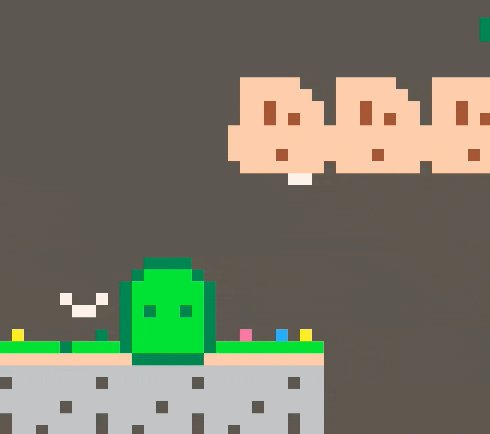

Bloob is the player character. A green square of jelly that you can move left, right, jump, and dash. You can also jump from walls and glide on them! Magnificent. I wanted Bloob to be simple, cute, and fun to move. I still want to improve animations, but ah. Perhaps in _Bloob 2: The Jelly Kingdom_!

## Walk

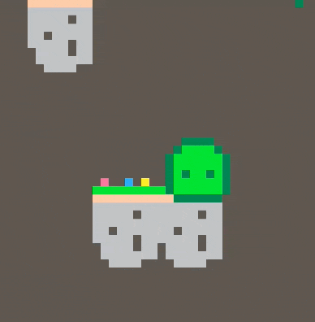

Walk is the most basic movement in Bloob. You can walk left and right. To make walking feel alright there's a tiny bit of acceleration on the x movement, and a tiny bit of deceleration when you stop walking. I also added another sprite so Bloob bobs up and down as it wobble around. Walk isn't the most exciting feature, but it's good to have it feel good.

## Bloobs

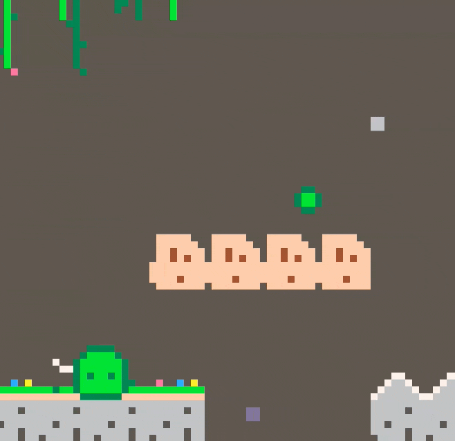

Bloobs are like Bloob, but smoll. You can find more bloobs throughout the world. They float around and you can absorb them to gain more.. Bloob. You need bloobs to jump higher and dash further to explore all of the world.

## Jump

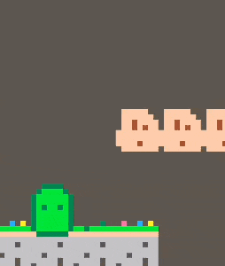

Jump is a fundamental part of the game. You can jump on the ground, in the air, and on walls. You can use the walls to jump your way higher and gain height. I wanted jumping to be fun and satisfying. It's the main way to get around in the game.

Jumping require bloobs. Bloobs are like Bloob, but smoll. You can find more bloobs throughout the world.

## Dash

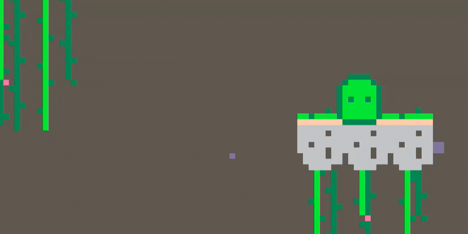

Dash is another fundamental part of the game. You can dash in the air to gain more distance and height. You can also dash on the ground to move faster. Dashing also require bloobs, so you need to find bloobs to be able to dash.

## Key

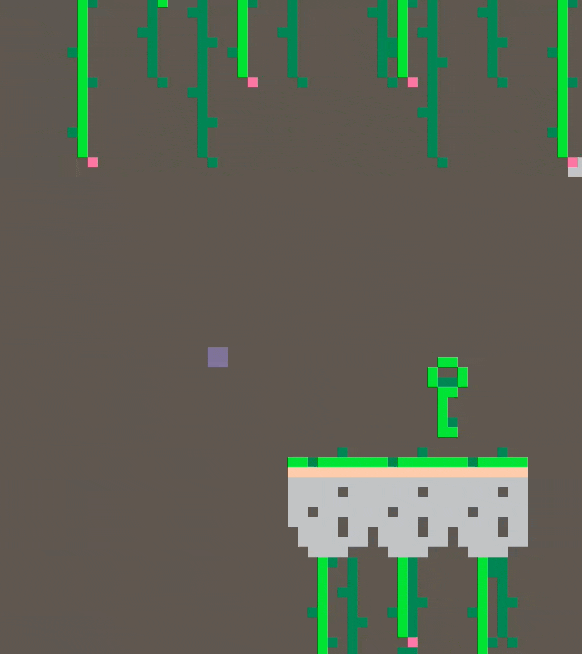

Keys! The main collectible in Bloob. At the beginning it was key, but then there were keys. I thought that design was a bit more fun. It meant that I could make more world! In the concepts I played around with a hidden.. level, and the key design made that feel sort of natural. Or well, it pushed the player to be curious, explore, and learn. I like that.

You need to find the keys to open the door and make Bloob free. The keys are hidden in the world, and you need to explore to find them.

## Door

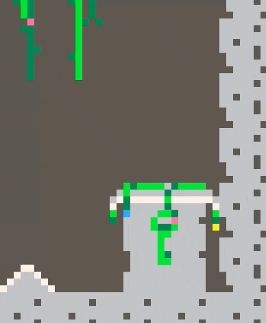

Ah. The door! Perhaps one of the best features of a video game. Did you know that some developers make it a thing to have the most mechanically complex door designs? I'm not talking just the visual design, also the unlocking, locking, and general how to of the door itself.

Some games even make mini-games inside the door!

Anyway. I wanted to have a door as the end goal of the level in Bloob. You need to find the key*s* to open the door and make Bloob free. The door is locked, and you need to find the keys to open it. The keys are hidden in the world, and you need to explore to find them. I wanted the door to be a nice reward for exploring the world and finding the keys. I also wanted the door to _feel good_, I think I managed to make it alright. The door magic is part particles, part funky sprite design and overlapping them, part opening design.

## Secret

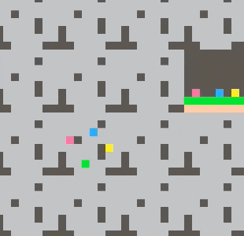

What's a video game without a secret? A video game. 🥁

I did want a tiny secret in this tiny dungeon though, so I added a secret that you can find by exploring. I won't say what or where. It's there. Can you find it?

## Wall slide (glide?)

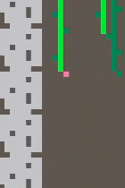

Wall slide is a silly movement that happen when Bloob hits a wall at a height. It makes Bloob slide down the wall instead of just falling down. I wanted to add this feature to make the game feel more fun and to encourage players to use the walls to their advantage. To make it a bit more interesting I added dust particles and a sprite swap.

## Crumble tile

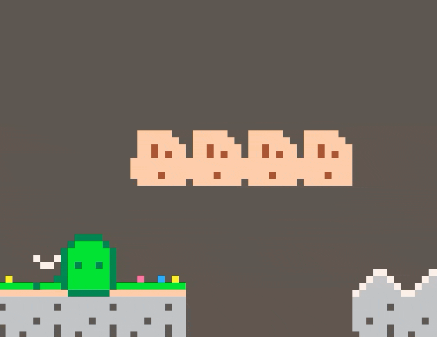

Crumble tile crumbles and disappear when Bloob step on them. This kind of tile is a pretty standard feature in platformers, so I wanted to add it to Bloob and see if I could solve that in a fun way. The particles, crumble effect, and missing tile indicator are all neat details that I think add up to make it feel good.

## Checkpoint

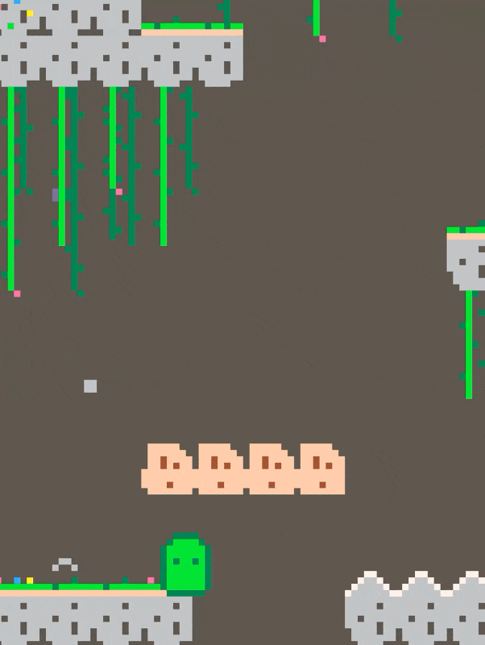

Ah. The checkpoint. A forgiving feature that lets the player respawn at a point in the level instead of starting over.

I like checkpoints and forgiving features in games. I mean, I'm a dad, the cutscene pause feature is crucial and without it I won't buy your game.

So in Bloob, you have checkpoints. They're tiny little tiles that activate when you step on them. If you jellify, you spawn on the active checkpoint instead of beginning a new run. Simple.

## Respawn

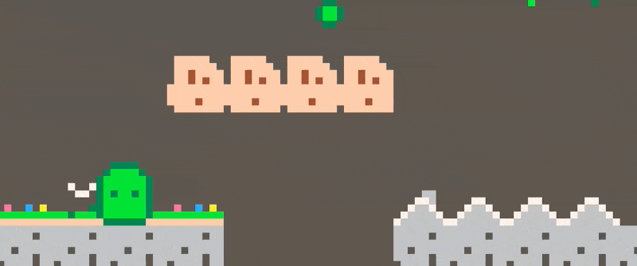

When you jellify, you respawn at the last checkpoint you activated. I wanted to make the respawn to feel like it made sense, so when Bloob turns into a bunch of jellies it made sense to stuff the jellies back together into Bloob. So I made a small particle effect of Bloob imploding on spawn, while still showing jellification.

Good thing I like jelly. Did you know that inside green jelly, there's apparently pink jelly?

## Particles

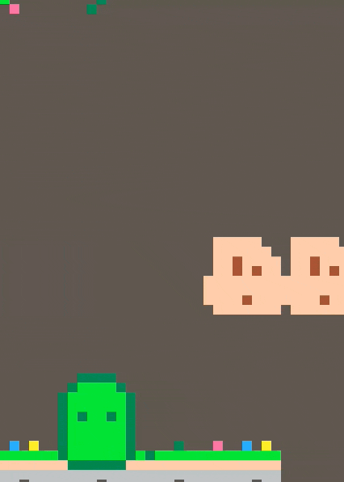

Particles! Bringing life to a video game.

I wanted particles in Bloob. It's a tiny (everything in Bloob is tiny, so this fits) detail that make the game feel alive and gives more visual feedback to the player. In Bloob there are particle effects when Bloob jumps, dashes, slides on walls, when tiles crumble, and when Bloob regrows and degrows.

Particles are a tiny and important detail for a good feeling. A long long time ago I designed particles for a student project and I really enjoyed that. So this was fun!

Look at some more particles.

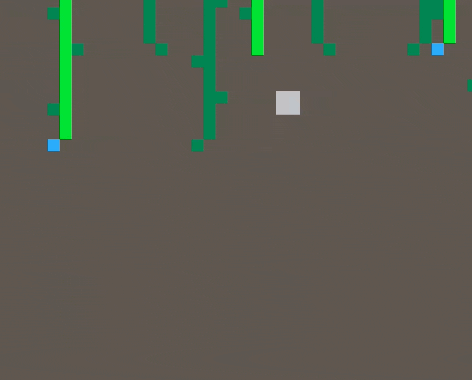

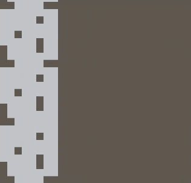

## Stats

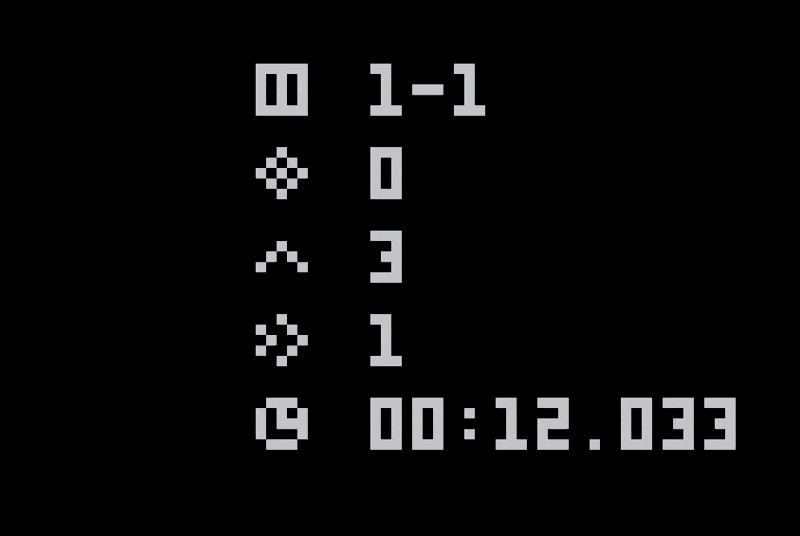

Statistics! I included stats for time spent in the game, how many times Bloob has jumped and dashed, which level and room you're currently in, and how many secrets you've found. I have some co-workers who began speed running and they requested milliseconds in the timer, seconds wasn't precise enough for them. They're glorious. :D

## Decoration

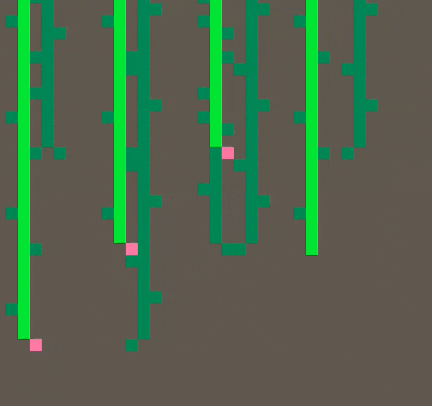

There's some decoration in Bloob. I wanted to make the world feel alive and interesting, and I love interactive environments so there's vines that sway when Bloob touch them. And there's grass and flowers that are added on top of the stone tiles, these are purely visual, and there's some growth over the door. Decoration in PICO-8 is super fun because every single pixel is so important, and I restrained myself to 8x8 tiles for most things except the door.

I might update in the future and have some background layer depth. But it's tricky because I don't have quite enough colors to make it look subtle and good.

# Ideas left in the kitchen sink

Plate trigger. A flat little plate that trigger _something_ when Bloob (or something) weighs on it.

Pushable block. A block that you can push to solve puzzles. Too complex for Bloob, maybe in a future game.

Multiple levels, worlds. I wanted to keep Bloob simple, and highly polished.

Hazards and environment. Snow, ice, water, sand. Too much for one level.

Parallax background. It's a nice effect, but I decided to make Bloob use single maps and not scrolling. So it doesn't make sense. Perhaps I'll add it in a future game.

# Learning

Making a video game is hard. That's what I've been reminded of.

I've learned a lot about PICO-8, picked up some things I'll use in future games, and more about sprites and pixels. Making a game is honestly just a lot of work, and there's many things that you simply have to think through and consider before, while, and after they're made. To make a game that _feels good_ require a taste and skill in many creative disciplines. What I enjoy most with PICO-8 is its limitations. It forces me to make more with less.

I'm glad I made Bloob and put it out there. Like any art, games are easy to drop when you're in the middle of the creative mess.

I hope you enjoy playing Bloob as much as I enjoyed making it.

# New game +

My next game will be smaller, and larger. I have three ideas that I think are worth exploring. I have lots of gameplay ideas for all of them, and roughed out concepts for one.

- Knithit. A tiny game about tiny knits.
- Stackasnack. A tiny game about stacking and kicking snacks.
- Shapedrifter. A tiny game about drifting and shapes.
