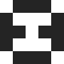
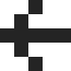
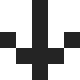
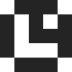
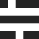
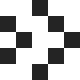

# No text

A core principle for Bloob was to have no text in the game. The only text is the win state that says "Bloob won!". But now that I think about it, I want to animate Bloob to move from side to side then jump up and down in celebration instead. I'll have to do that now.

Back to icons!

# 5x5

Hold up! Isn't the PICO-8 sprite size 8x8 pixels? Yeah, but I want more limitation so I made them smaller! And I wanted uniform height and width so they read well when placed together.

I'm not sure what the smallest legible pixel font is. If it's monospaced, I'm guessing it's 5x5 pixels. Oh.. Oh no, now I want to make my own pixel font for the fun of it. Perhaps get the font published on Google Fonts? Sounds like a new project.

But, let's get back to the icons, again.

Five pixels by five pixels. That's tiiiiiiiiny. 🤏🏻

Is it enough?

Will it be expressive enough?

Can it be read?

Scroll along to find out.

But I thought it was just enough to be expressive and readable. I started by drawing the icon for Bloob. If I could get that shape right I thought I could get the rest right too. Kind of like how icon sets often start by defining a key icon like a house or head.

So the challenge was to make recognizable shapes in such a small space.

# Icons

Bloob. The base icon. A square with two eyes. Very simple, and it works. The shape is similar enough to Bloob in game.

Left arrow. Reset. Back to start. This one hurt a bit, I might make a curved arrow instead. But it's tricky with 5 pixels. I think I need 8x8 for that, and I want 5x5.

Down arrow. Sit down to read the menu. No, honestly the button was available. Hehe! And some people wanted the jump to be separated from the arrow controls, which is easy to understand if you want to move like a parkour.. er.. or have sausage fingers.

Map! As simple as it gets.

Clock. Looks like the time is 12:15, or is that 15:00? Readability checks out, ish!

Menu. I don't like hamburgers, oh who am I kidding, I love hamburgers. But I'm tired of hamburgers, so I made some small changes, since it's more than a menu, more of a pause button and stats and some more stuff. I think the general hamburger shape menu still reads.

Secret. It was either a gem or a star. I went with gem, since the only thing in my mind while making it was what the icon should communicate? So I thought of what the secret hid in the game. Form follows function and all that jazz.

Kind of looks like a gem, I mean, 5x5 is tiny after all.

Jump. The jump icon needed to differ from an arrow, since it's.. a jump, not up. So I made a little arc. It's very simple obviously, and I like that.

Dash. The dash icon needed to differ from an arrow, since it's.. a dash, not right. So I made two little arcs, one big followed by one small, kind of like Bloob when it dashes. Also very simple, and I like that too.

Wheee! I like all of my tiny icon babies. I hope you like them too.

Do you need icons for your game? I make them for fun, and I think it could be fun to make them for you too. Reach out, check the footer below. I trust you'll figure it out.
