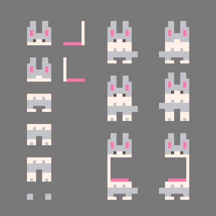
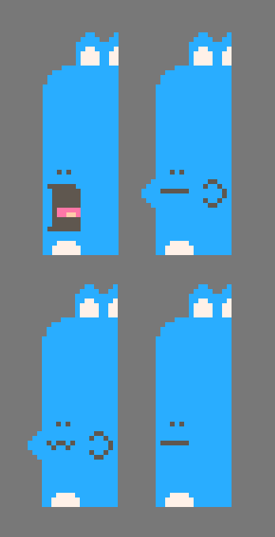

You can play Stack a Snack in your browser below.

<iframe
  src="/pico-8/stackasnack/stack_a_snack.html"
  title="Play Stack a Snack, a PICO-8 game"
  class="bloob-embed"
  data-no-responsive-wrapper
  allowfullscreen
></iframe>

You can also play it on [itch.io](itch.io/stack-a-snack) and [Lexaloffle](https://www.lexaloffle.com/bbs/?tid=159568), or download the cartridge below and load it into your PICO-8 emulator device.


# Idea

I'm not entirely sure where the idea for Stack a Snack came from. It's a mix of everything that floats around in my head.

The idea took shape in my head before Falling Block Jam, and I didn't know this jam was a thing until I had gone into think mode (drawing dots and lines on a piece of paper).

So that this happened coincidentally was fun.

A bit sad about not being able to officially join the jam, they have a zero generative artificial intelligence policy (which I like, don't get me wrong). Fair enough. Since I don't know how to code a game like this, I used Claude to help me. And in many ways it feels wrong to say that I participated in the Falling Block Jam? So I'll just say I made my game alogside the jam. I'm happy the jam pushed me though. Without it, I would not have released it as soon, it was made in roughly 6 days (not full days, I'm a dad, and have a day job).

I had fun! I like to draw pixels, and design games. Coding is mythical to me, and I'm slowly working on understanding more of the concepts. A goal of mine is to hand code a PICO-8 game on my own. Maybe my next idea! If I keep it simple.

Anyway, I've always liked cake.

So for the falling block part, cake it is. Falling cake.

I also like bunnies. Who doesn't?

So that was the player and non player characters sorted. The big blue one is silly. I love that. I like wonky, uneven, different. I try to get that feeling in everything I make. I'm also happy with the simple animations, 2-3 sprites at most, it gets the point across and is lightweight.

# Sprite (pixels)

I drew all the game sprites in 8x8 pixels using [Pixelorama](https://pixelorama.org/), which is a nifty little pixel editing software. The label image is drawn in 128x128 pixels and imported into the label section.

Gray bunny (player) is made up of 9 sprites, 4 tiles. The tail and open mouth sprites are placed on the left or right side, depending on the direction you're facing and moving. I really like the expression of the open mouth, haha.



Blue bunny (non player) is made up of 13 sprites, 13 tiles. Where 1 tile only show when chewing (right cheek, left on screen).



Cakes (non player) are made up of 6 sprites (pink and blue variant), 3 tiles at most (in a 3 layer cake stack).

# Gameplay

I'll dive into the small details on how the game plays and what, apart from the obvious falling block subgenre, made me design the game like this later.

# Code 

This is some of the more interesting code sections, with my comments on what the code does. Since the code is generated by artificial intelligence, reading and commenting in my own words help me understand how it works.

## Cake comparison
```lua
-- a stack (all(a)) only matches another stack (all(b)) that's identical to it piece for piece (all(counts)).
function same_stack(a,b)
 if #a!=#b then return false end
 local counts={0,0,0}
 for f in all(a) do counts[f+1]+=1 end
 for f in all(b) do counts[f+1]-=1 end
 for c in all(counts) do if c!=0 then return false end end
 return true
end
```

## Constant values
```lua
spit_y=stand_y-14 -- bottom line height the spat-back cake flies at
spit_speed=2 -- constant px/frame, independent of travel distance
throw_speed=3 -- constant px/frame for a thrown pink cake
cake_max=3 -- max cakes in either a held pink stack or a falling blue stack, cake sprites are only inked in their own bottom 2 rows, so a 2px offset between stacked cakes is what makes their pixels sit flush
blue_stack_gap=2 -- gap of at least 16 pixels (2 tiles) between falling blue cakes
blue_stacks_max=2 -- at most this many blue cakes falling at once
blue_spawn_gap=150 -- minimum frames between one blue stack spawning and the next, so a second one doesn't start right on top of the first even when the cap above would allow it
```

I'll add more code later.
