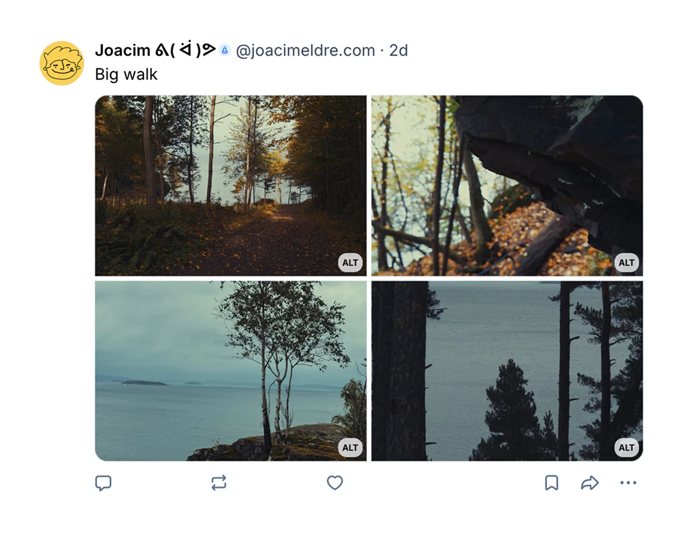

I think that making a logo for yourself as a designer is a daunting task. Because of all those decisions and details that matter.

Glad I was happy enough to share it and *make it exist*, I'll make it pretty another time. I'll dive back into Affinity to learn about their new and improved vector drawing features.

Ah, and since I'm writing about logo design and I enjoy doing this, let me tell you about a couple of things that makes a logo stand out to me. I guess you could call it a good logo if it fits these simple rules.

Balance, more signal than noise, and that seeing it makes you happy.

That's it. Doesn't sound hard.
