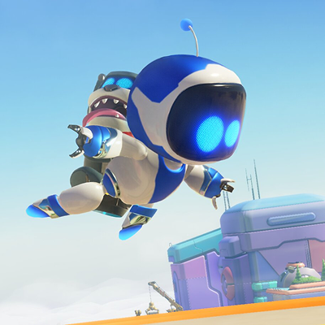

# Astro Bot

Astro Bot is **one of my favourite video games, ever**. I picked it up in the end of 2024, and played through 2025. I still play from time to time. Family friendly too.

You play as Astro, a small robot that's on a mission to rescue all of their friends and find parts to fix their spaceship, a PlayStation 5. 

Throughout the game you meet various attachments that lets you do different things, like frog gloves that springs your punch, or monkey hands that lets you grab and climb. You run around and jump on platforms, solve puzzles, and bonk peculiar enemies and bosses. Oh and along the way you collect little bots and secrets hidden throughout the game world. It's a super creative game made with a lot of heart and attention to detail.

Astro Bot is playable on PlayStation 5.

- [ ] Play Astro Bot.

I included the checkbox above, because I just managed to program it so it's possible to interact with. Give it a try! Now I'm curious if I can make it so that you can write your own checklist, and check it off as you go. That would be fun! Maybe I'll make that a project for myself.

I'll add more later.