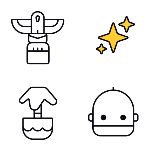

Icons are used to visually represent concepts, actions, figures, or objects in a compact and easily recognizable form. You can use icons in your product to make it easier to understand and visually appealing for whoever uses it.

I've designed icons for fun for a long time, and I enjoy it a lot. I like the challenge of trying to visually represent something in a simple and clear way. It's a fun puzzle to solve, and it's rewarding to see the final result. I also like that icons can be used in many different ways, like in apps, websites, logos, and in physical products.

## Inspiration

I get inspiration for icon design by life around me. Nature, human made objects, and things on the internet.

I typically sketch icons with a pen on paper. It's fun to see what pops up. When I have the look and feel that I want, I finalize the icon in a vector format. All of the icons in this post are made purely for the fun I get from creating them.

Other times fine people ask me to design icons to visually describe their thing. Once in a while they know what they want, or we find out together. Then we go from there.

If you'd like to work together or just say hi, [send me an email](mailto:hei@joacimeldre.com).

## Tools

I use a Copic Multiliner pen, thick paper, and [Procreate](https://procreate.com/ "Procreate is an app for raster drawing on iPad") to sketch icon ideas. And I use [Figma](https://figma.com/ "Figma is a web application for prototyping with vector graphics and allows for easy collaboration") to finalize the icon designs in vector format.