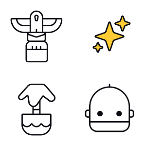
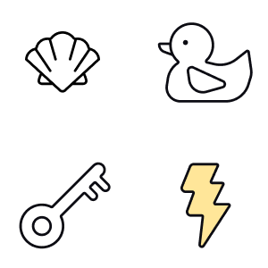
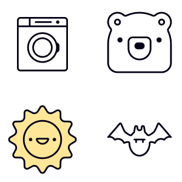

Icons are used to visually represent concepts, actions, figures, or objects in a compact and easily recognizable form. You can use icons in your product to make it easier to understand and visually appealing for whoever uses it.

I've designed icons for fun for a long time, and I enjoy it a lot. I like the challenge of trying to visually represent something in a simple and clear way. It's a fun puzzle to solve, and it's always fun to see the final result. I like that icons can be used in many different ways. From digital apps and websites, to physical products like toys and clothing.

Let's work together or just say hello, [send me an email](mailto:hei@joacimeldre.com).

# Inspiration

I get inspiration for icon design by life around me. Nature, human made objects, and things on the internet.

I typically sketch icons with a pen on paper and it's always fun to see what pops up. When I have the look and feel that I want, I finalize the icon in vector graphics. All of the icons in this post are made purely for the fun I get from creating them.

Other times fine people ask me to design icons to visually describe whatever they need for their thing. Once in a while they know what they want, and if they don't, we find out together.

Then we go from there.

# Dream 🦄

A dream of mine is to design icons for a video game or physical toy.

And to make an icon font or library and package it in a way that's makes it easy to use for people in their own projects. Kind of like Font Awesome! Oh, it would be incredible to contribute to their icon library.

I have a lot of fun designing icons and it would be nice to share them with others.

# Tools

To sketch icons I use a Copic Multiliner pen, thick paper, and [Procreate](https://procreate.com/ "Procreate is an app for raster drawing on iPad").

To finalize icons in vector graphics I use [Figma](https://figma.com/ "Figma is a web application for prototyping with vector graphics and allows for easy collaboration") or if I need more features, [Affinity Studio](https://affinity.serif.com/en-us/studio/ "Affinity Studio is a desktop application suite for vector and raster graphics").