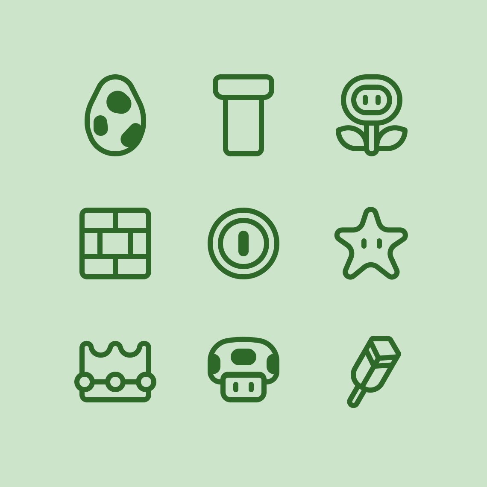

Let's a go! Icons made to celebrate Mar 10. Mario day!

I drew the icons in 64x64 pixels with a 4 pixel stroke. I had a lot of fun making these, and I hope you like them! Next year I'll attempt pixel art icons.

